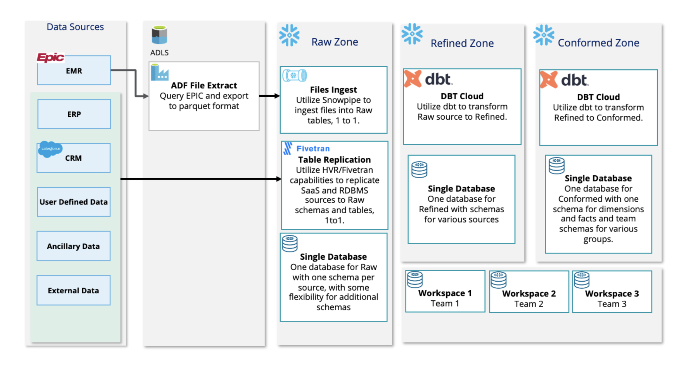
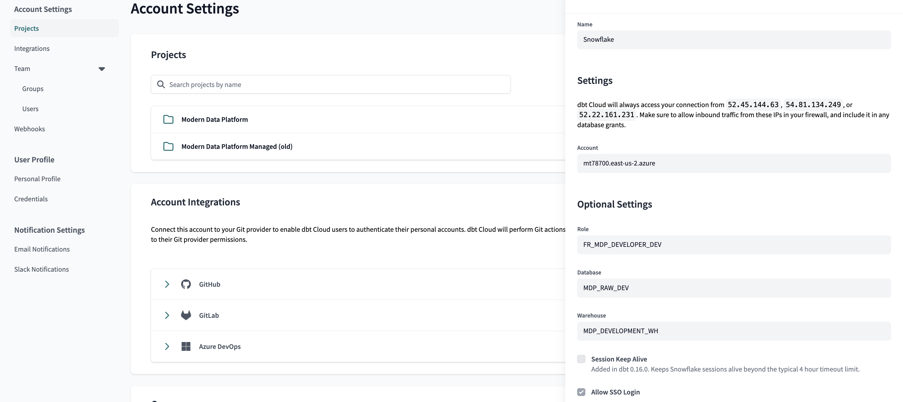
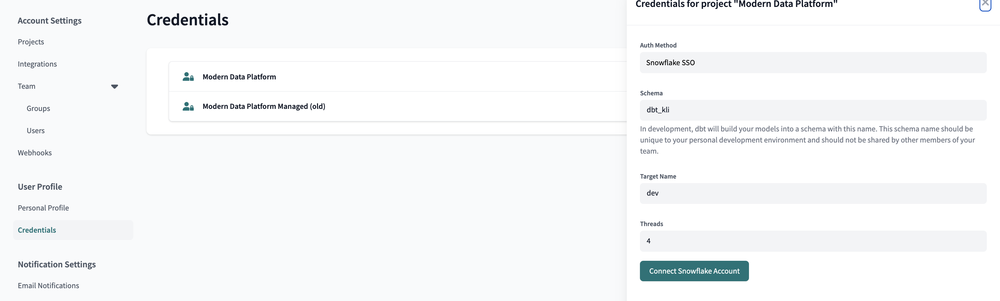
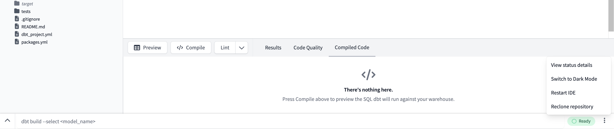

<details open>
<summary>Modern Data Platform</summary>


# Modern Data Platform

This dbt project is utilized to build the Modern Data Platform on Snowflake at Advocate Aurora Health.

## Table Of Contents

- [Pre-project Checklist](#pre-project-checklist)
- [Solution Architecture](#solution-architecture)
- [Data Pipeline Lifecycle](#data-pipeline-lifecycle)
- [MDP dbt Project Components](#mdp-dbt-project-components)
- [Appendix](#appendix)

### Pre-project Checklist

Each team member should have the following access:

- [ ] Snowflake (https://mt78700.east-us-2.azure.snowflakecomputing.com/)
- [ ] Member of dbt Cloud Project
- [ ] Write Access to Azure DevOps dbt Project repo
- [ ] Access to Snowflake database(s) including DEV, QA, and PROD environments
- [ ] Snowflake Role FR_MDP_DEVELOPER_DEV

<details close>
<summary>Solution Architecture  (Update Graphic) </summary>

### Solution Architecture

The following high-level diagram depicts how data will be ingested from sources such as Epic Clarity and Caboodle into a Snowflake raw layer, cleansed and integrated in the refined layer, and modeled in the conformed layer for downstream analytics. The diagram is available as a template in Miro [here](https://miro.com/app/board/uXjVP8uiR7s=/?share_link_id=809372791811) and show below:



</details>

<details close>
<summary>Data Pipeline Lifecycle & Walkthrough for Clarity (Manual introduction to process, will need to create steamlined process) </summary>

### Clarity Data Pipeline Lifecycle

The following steps document the lifecycle of a data engineering pipeline on our project from designing a target data model, ingesting data into Snowflake, transforming it and finally serving it up for analytics and other downstream uses.

#### 1. Design Target Data Model

The lifecycle of a data pipeline begins with a business need for data and the design of a target data model in the conformed layer to fulfill the need. The target data model should be documented in the [Source to Target Mapping template](https://advocatehealth.sharepoint.com/:x:/r/sites/GRP-MDP-Cloud-Data-Engineering/_layouts/15/Doc.aspx?sourcedoc=%7B97987260-F04C-41B4-9586-ED4BDC6163A3%7D&file=Tegria%20Source%20to%20Target%20Mapping%20v0.1.xlsx&action=default&mobileredirect=true&cid=97321923-186a-4625-92c9-8885f573b51a) and stored in Microsoft Teams [here](https://advocatehealth.sharepoint.com/:x:/r/sites/GRP-MDP-Cloud-Data-Engineering-MVPImplementationPhase/_layouts/15/Doc.aspx?sourcedoc=%7B61D072C1-0445-4E78-94D0-31B74EC4F60B%7D&file=Tegria%20Source%20to%20Target%20Mapping%20v0.1.xlsx&_DSL=1&action=default&mobileredirect=true&cid=a5b77b14-db87-4dba-bc79-f0b85d5a8562). The Source to Target Mapping document will provide a list of source table(s) that are needed to build the target table along with a mapping at a column level from the source table(s) to the target table, including any transformations.

#### 2. Design Data Pipelines

Once the target data model design is complete, the data engineering team can leverage the Source to Target Mapping document and dbt project standards that have been defined to design the data pipeline. The design should include the following:

- Purpose
- Model files required in each layer
- Use of any packages/macros
- Tests to be applied in addition to the standard suite of tests
- Exposures and/or metrics
- Seed files and any outside data not in Snowflake
- Any deviations from the standard naming conventions and model organization

The data pipeline design will be documented in a GitHub issue using a standard issue template to cover the above items. If it is not explicitly called out in the data pipeline design the dbt articles should follow the standards below for [Model Organization](#model-organization), [Model File Naming and Coding](#model-file-naming-and-coding), [Testing](#testing), and the [SQL Style Guide](#sql-style-guide).

#### 3. Build Data Pipelines ** WALKTHROUGH STARTS NOW **

The following steps should be followed for each dbt-based data pipeline:

##### a. Create a branch in the GitHub Repository

Once a data engineer has been assigned an issue to develop a given data pipeline, they should begin by creating a branch in the dbt project repository and name the branch using the following [Branch Naming Convention](#branching-strategy).
A branch can be created from the main branch using the dbt Cloud UI.

###### Configuring Development Profile

Development profile will be pre-populated per user account creation. However, follow the below walkthrough steps to validate your profile and configure your target name.

<details close> 
<summary>Walkthrough</summary>

1. Click on the gear icon on the upper right side of the console. Then go to Projects and click on Modern Data Platform.
2. Ensure the repository is connected to Azure [MDP_DBT_Cloud repository](https://AAH-MDP@dev.azure.com/AAH-MDP/Modern%20Data%20Platform/_git/MDP_DBT_Cloud).
3. Ensure Snowflake connection has correct configurations (You should not need to change OAUTH Login parameters):
   
4. On the far left drop down click Credentials and navigate to Modern Data Platform.
5. Make sure Target Name is set to "dev".
   
6. After changing the Target Name to "dev", click the "Connect Snowflake Account" button.
7. Follow all the error recommendations including:
   - Restart dbt IDE
   - Run dbt deps
     If this does not work immediately (check green ready box at bottom-right screen), give it up to 24 hours.

</details>

##### b. Ingest source table(s) to Snowflake

The ingestion of data into Snowflake will be performed by Azure Data Factory and Snowflake pipes for Epic Clarity and Caboodle. Other source systems will leverage Fivetran or HVR, where possible. Depending on the source system, the data engineer will performing the following steps to ingest data into Snowflake:

###### Azure Data Factory and Snowflake Pipes

Once data has landed in Azure Data Lake Storage it can be copied into Snowflake via macros in the [dbt-external-tables package](https://github.com/dbt-labs/dbt-external-tables/tree/0.8.2/). This will create a pipe using a Snowflake Storage Integration, Notification Integration, File Format and Stage.
Perform unit testing and include screen shots in your pull request to show how file(s) were initially loaded and then subsequent files were loaded during a second load.
Reference [Ingestion Standards](#ingestion-standards) for background on this processes, and [Macros](macros) to refer to the yml_gen.sql macro used to compile the data source.yml that will build the landing tables and snowpipes.

<details close>
<summary>Walkthrough</summary>

1. Switch to your testing branch and make sure it is updated with main.

- Also ensure the status of the console (bottom right pill) says Ready. Sometimes the dbt to Azure repo connection might have trouble connecting (Server issue). Clicking the settings and restarting or reclone the repo will help if it is a server issue.

  

2. If this is a new data source, the raw raw_sf_objects_config macro will need to be ran. Update the project.yml with the name of the datasource in the schema_list variable. Afterwards, run the following command in the command line:

```
dbt run-operation raw_sf_objects_config --args '{rebuild_flag: false}'
```

    * Selector syntax is also available to build one table in a run:

    ```
    dbt run-operation stage_external_sources --args "select: raw_clarity_aah.RAW_[TABLE_NAME]"
    ```

3. Open a new file tab, and input the yml_gen macro with given inputs (name of azure folder for the data source and an exclude list for tables not to compile).

```
-- depends_on: {{ ref('column_config') }}
{{
  yml_gen('ClarityPOC',[
  'V_ADT_ED_ADMITS','V_DW_TEST_PATIENTS','V_SCHED_APPT','V_ADT_EVS','V_IMG_STUDY',
  'ZC_DELAY_REASON','ACCESS_PROV','ACCESS_PROV_DELETE','F_SCHED_APPT_STATS', 'F_SCHED_APPT_STATS_DELETE','CLARITY_POS','CLARITY_POS_DELETE',
  'RAW_CLARITY_SER_SPEC_COMPARE','RAW_CLARITY_LWS_COMPARE','RAW_CLARITY_PRC_COMPARE','RAW_PATIENT_5_COMPARE','CLARITY_EMP_COMPARE','RAW_CLARITY_EMP_COMPARE','RAW_IDENTITY_ID_COMPARE','RAW_ORDER_RAD_AUDIT_COMPARE'])
}}
```

4. Press Compile to generate the \_clarity_sources.yml. This will take a couple of minutes to load depending on how many tables are in your stage.
5. Copy and paste the compiled output into the \_clarity_sources.yml file located in models/raw/clarity_aah/ .
   - Do not include the " -- depends_on: {{ ref('column_config') }}" line at the top.
6. If there are edge cases (missing or differently formatted tables), manually input the table and its configurations into the \_clarity_sources_manual.yml following the format of other tables.

   - There cannot be 2 of the same data source. Therefore if an a table is made in the \_clarity_sources_manual.yml file, this table entry needs to be removed if present in the \_clarity_sources.yml file
   - To ensure that future builds won't populate \_clarity_sources.yml.yml, it would need to be included in the exclude list parameter for the yml_gen macro call.
   - If the table needs to be readded/rebuilt in \_clarity_sources.yml.yml, then the entry in \_clarity_sources_manual.yml would then need to be removed (Example: Clarity updates and column_config is correct).

7. In next steps we rebuild landing table and snowpipes. To test if it works, we can drop a snowpipe and landing table in dev. (Ensure that the commands below are entered into Snowflake, not dbt.)

```
use role FR_MDP_DEVELOPER_DEV;
use warehouse MDP_DEVELOPMENT_WH;
drop table if exists mdp_raw_dev.clarity_aah.raw_zc_appt_block;   --drops landing table
drop pipe if exists mdp_raw_dev.clarity_aah.raw_zc_appt_block;    --drops snowpipe for the table

```

8. Run the external table labs macro by inputting the below command into the command line to build the new tables (This will not rebuilt tables, only added new ones).

```
dbt run-operation stage_external_sources
```

9. Validating by checking your snowflake environment to ensure snowpipes and landing tables are built in the raw schema.

- The dbt logs will show the DDL/DML scripts (may need to manually scroll through as ctrl + F can have issues)
- Run snowflake commands below to check the information schema for the recreation of the table and snowpipe:

```
use schema mdp_raw_dev.information_schema;

select pipe_name,created from MDP_RAW_DEV.INFORMATION_SCHEMA.PIPES
where pipe_name = 'RAW_ZC_APPT_BLOCK';

select table_name,last_ddl from MDP_RAW_DEV.INFORMATION_SCHEMA.TABLES
where table_name = 'RAW_ZC_APPT_BLOCK';

```

</details>

###### Fivetran

###### High Volume Replication (HVR)

##### c. Build Raw dbt model(s)

Raw model files will be created for each source table/file. Raw models should include descriptions from the metadata tables pulled in from Clarity (i.e. INI, Item, etc) and testing for source freshness. Furthermore, depending on the load type (Incremental vs Full) helper tables will be created within the delete handling folder.
These model files leverage the Tables macros.

<details close>
<summary>Walkthrough</summary>

Full load tables are tables in which the latest file upload should be the table. This means the table is truncated and replaced with the data in each day's file upload(s).
Incremental loads are tables in which file upload(s) should be merged. If it is a new record this will be appended. If the record already exists, it will be updated.
Furthermore the delete table will be used to remove records.

<details close>
<summary>Identifying Incremental vs Full Load</summary>
Tables in the _clarity_sources.yaml will that have a corresponding delete table (same name + _DELETE suffix) will be incremental tables. While tables without will be full load tables.

Example: RAW_CLARITY_EPP AND RAW_CLARITY_LWS are the only incremental tables here.


</details>

###### Full Load

**WARNING** (case sensitivity): file names and inputs should be lower-case.

1. Validate by checking both \_clarity_sources.yml and snowflake raw schema to validate the landing table exists.
   - The name of the landing table will be: "RAW\_[TABLE_NAME]"
2. Create a new file in models/raw/clarity_aah/delete_handling/full_load
   - The name of the file will be: "raw\_[table_name]\_latest.sql"
3. Paste the below code into the file. Fill in the variables with the right parameters and save.

```



{{ clarity_full_load_delete_handling(source_model_name=source_model_name,instance_name=instance_name) }}
```

Example:

```



{{ clarity_full_load_delete_handling(source_model_name=source_model_name,instance_name=instance_name) }}
```

###### Incremental Load

**WARNING** (case sensitivity): file names and inputs should be lower-case.

1. Validate by checking both \_clarity_sources.yml and snowflake raw schema to validate the landing table and delete table exists.
   - The name of the landing table will be: "RAW\_[TABLE_NAME]"
   - The name of the delete table will be: "RAW\_[TABLE_NAME]\_DELETE"
2. Create a new file in models/raw/clarity_aah/delete_handling/incremental
   - The name of the file will be: "raw\_[table_name]\_src_operation_history.sql"
3. Identify If the primary key is unknown for a given table. Run the below command in a new tab or snowflake.

```
select table_name, column_name
from MDP_RAW_DEV.GENERAL_MGMT.COLUMN_CONFIG
where primary_key is true
and table_name = 'TABLE_NAME'
order by pk_line asc;
```

4. Paste the below code into the file. Fill in the variables with the right parameters and save. If there are composite keys use a list instead of a string.

```

 #use if 1 primary key
  #use if multiple primary keys

{{ clarity_src_operation_history_table(clarity_table_name, primary_keys) }}
```

###### Build raw model

Once the raw model file is written and saved, the model can be built by pressing the build button in the console.


Afterwards, validate in snowflake raw schema that the table (will have the same name as the file name) exists.

The dbt run logs can also be opened to refer to the scripts ran and status.


Snowflake Query Example:

```
SELECT * FROM MDP_RAW_DEV.CLARITY_AAH.raw_clarity_lws_src_operation_history;
```

</details>

##### d. Build Refined dbt model(s)
<<<<<<< HEAD

**TO DO describe unit testing**
=======
>>>>>>> 679936b207f86d687746a04ff98a944df6f4599e

Refined model file(s) will be created to cleanse,standardize, and dedupe the data from Raw models. These models should include the custom row count validation test created in dbt (for Clarity tables only, more info in the Testing Strategy section).
These model files leverage the Tables macros.

<details close>
<summary>Walkthrough</summary>

Full Load

1. Create a new file in models/refined/clarity_aah/base_tables/full_load

- The name of the file will be: "[TABLE_NAME]\_base.sql"

3. Paste the below code into the file. Fill in the variables with the right parameters and save.

```


{{ clarity_refined_base_full_load_table(clarity_table_name=clarity_table_name) }}
```

4. Create a new file in models/refined/clarity_aah/views

- The name of the file will be: "[TABLE_NAME].sql"

5. Paste the below code into the file. fill in the variables with the right parameters and save.

```



{{ clarity_refined_view(clarity_table_name=clarity_table_name,except_columns=except_columns) }}
```

    * example of Except_coluns:
    ```
    
    #this will exclude col_1 and col_2 from the view
    ```

Incremental Load

1. Create a new file in models/refined/clarity_aah/base_tables/incremental

- The name of the file will be: "[table_name]\_base.sql"

3. Paste the below code into the file. Fill in the variables with the right parameters and save.
   - The config block ensures the table will not build from scratch on dbt jobs and instead merge new data to existing table.

```
{{
    config(
        materialized='incremental',
        unique_key= 'primary_key_1','primary_key_2'  #use if multiple primary keys
        unique_key = 'primary_key'  #use if one primary key
    )
}}


 #use if multiple primary keys
 #use if one primary key

{{ clarity_refined_base_incremental_table( clarity_table_name, primary_keys ) }}
```

4. Create a new file in models/refined/clarity_aah/views

- The name of the file will be: "[table_name].sql"

5. Paste the below code into the file. fill in the variables with the right parameters and save.

```



{{ clarity_refined_view(clarity_table_name=clarity_table_name,except_columns=except_columns) }}
```

###### Build refined model

Once both refined models are written and saved (build base model then the view), the model can be built by pressing the build button in the console (same as in raw).

Afterwards, validate in snowflake refined schema that the table (will have the same name as the file name) exists. The dbt run logs can also be opened to refer to the scripts ran and status.

Snowflake Query Example:

```
SELECT * FROM MDP_REFINED_DEV.CLARITY_AAH.clarity_lws_base;
```

###### Include testing into the refined model 

Finally, once the model is properly built and available we have to include the row count validation testing for Clarity data. This test has been defined as a custom generic test in dbt under the file *check_clarity_row_count_against_source.sql* and to apply it into new models there’s a couple of steps to follow: 

1. Include the model in the yaml file located at models/refined/clarity_aah/views/_refined_views.yml (if not there already)
2. Add the test as a property under the new model included in the yaml file in the way described below. You could add the same line for other models as well and each will add a new test to your project, using the same generic test definition defined in check_clarity_row_count_against_source.sql

  ```
  version: 2

  models:
  - name: new_model_name
    tests: 
        - check_clarity_row_count_against_source

  ```
3. To review the proper functioning of the test, you can run the command *dbt test --select new_model_name*, which will run all the different tests that have been applied to that specific model. In the examples below, the first test passed and the second failed. 

  

  

4. Also, once the test has been added to the _refined_views.yml, if you run *dbt build --select new_model_name* dbt will first run the model (dbt run) and then the test will start automatically right after the model was successfully built (dbt test).  

  

5. Finally, when the changes are merged to the main branch all the tests that have been defined for the different models will run whenever a new dbt job is running, which are currently set up to run the *dbt build* command for all the objects defined in the dbt project.

<details>
<summary>Debugging test failures</summary>

When the test fails, it means that the Clarity metadata row count for a given table differs from the row count of the refined model built for that same table, and that we have already verified that the table has been backfilled and it is enabled for the ingestion process.

If we're still in Dev environment, we can review the code executed by the test to start debugging it. To do this we have to go directly to the dbt develop area and run the *dbt test --select modelname* command and click on the Details button available in the results pane, below the check_clarity_row_count_against_source_modelname_ (see image below) and scroll down to see the SQL query that was run with our model.

  

It’s important to consider that the query will be divided into two parts, the first will evaluate the row count difference and the second will either:
- Retrieve *select 0 as row_count_test_severity_check* when there’s no row count difference (diff = 0)
- Evaluate further conditions (status of the backfill, table enabled, date consistency, etc) and set row_count_test_severity_check as 1, 2, 3, 4 or 99 depending on the scenario present (more details in the Testing Strategy section). In that case, only the value 1 will throw an ERROR and those greater than 1 will throw a WARN

For the first part, we can copy and paste the SQL code into a new dbt tab and run it as usual to get the exact values for the differences. In case we want to gather extra information and not only the differences we can slightly adjust the query in the following way:

```
  with source_row_count as 
  (select total_row_count
  from mdp_raw_dev.general_mgmt.source_table_size_latest
  where table_name =  upper('table_name'), 
                  
  clarity_row_count as 
  (select count(*) row_count
  from mdp_refined_dev.clarity_aah.table_name), 
      
  row_count_validation as 
  (select a.row_count - b.total_row_count as diff,
  a.row_count as model_row_count,
  b.total_row_count as clarity_md_row_count
  from clarity_row_count a
  inner join source_row_count b on 1=1)

  select * from row_count_validation

```
Then for the second part, we could double check the other conditions assessed for the table by copying the the SQL code generated and paste it as we did with the one above. For a more detailed explanation on this process go to the Debugging subsection in the Testing Strategy section. 
</details>

</details>

##### e. Build Conformed dbt model(s)
<<<<<<< HEAD

**TO DO describe unit testing**
=======
>>>>>>> 679936b207f86d687746a04ff98a944df6f4599e

A Conformed model file will be created to prepare data for consumption by analysts and other downstream uses. Make sure to use the ref macro to refer to other models when building. Conformed models should include testing for uniqueness, referential integrity (where applicable), not null fields and descriptions for the purpose of each model and column from the Source to Target Mapping.
This will rely heavily on the [source to target mapping](https://advocatehealth.sharepoint.com/:x:/r/sites/GRP-MDP-Cloud-Data-Engineering-MVPImplementationPhase/_layouts/15/Doc.aspx?sourcedoc=%7B61D072C1-0445-4E78-94D0-31B74EC4F60B%7D&file=Tegria%20Source%20to%20Target%20Mapping%20v0.1.xlsx&_DSL=1&action=default&mobileredirect=true&cid=a5b77b14-db87-4dba-bc79-f0b85d5a8562).

<details close>
<summary>Walkthrough</summary>

This walkthrough will use AdtPendedEventFact as an example of the processes used for development.

1. Create new file in the models/conformed/base_tables named after the conformed model.
2. Use the Source Join Mapping tab and filter to given model to find all the tables used as well as the joins.
   - This can be done by filtering the Table column to the conformed table which is being built.
   - Identify the tables used here in the source or target tables and bring it into the dbt file
   - Bring in the refined based tables as cte's and perform the joins in the final select.

<details close>
<summary>Example</summary>


- The first four highlighted tables may have slightly different names from the source to mapping excel file (left) vs the conformed model file (right), but they are referring to the same thing.
- The section boxed in red grabs all the needed columns from the "Colum Mapping" tab and joins all the 4 highlighted tables together in the CTE used for the final conformed model.

</details>

3. Use the Column Mapping tab and filter to given model to find all neccessary columns. From here, paste into the conformed model while referencing the correct data types and new target names.
4. Organize selected columns into below sequence with applied operations:

| Category   | Description                                                                   |
| ---------- | ----------------------------------------------------------------------------- |
| keys       | These are primary and foreign keys. The dbt_utils macro will be used to hash. |
| ids        | These are identifier fields, but not used to join with other tables.          |
| dimensions | These are other dimensional fields (strings,numbers,booleans)                 |
| dates/time | Date and Datetime fields                                                      |

5. Build a view selecting all from this base table in models/conformed/views

###### Include testing into the conformed model 

For conformed models we are implementing for now only some generic tests that are already available in dbt such as:
- unique: the column should be unique
- not_null: the column should not contain null values
- accepted_values: the column should only contain values within the specific list provided
- relationships: tests whether the table relationships are consistent. In other words, any foreign key field must agree with the primary key that is referenced by the foreign key (also known as referential integrity)

To include those open the models/conformed/views/_conformed_views.yml file and add the new conformed model along with the required fields (names, description, columns). Some these generic tests are specified at a column level and by including the test config info under a column we are adding a test to it. In the following example, we are adding a test to check if the primary key for the adt_event_fact (adt_event_key) is unique, however, we're not enforcing that to pass/fail by adding an extra config step to change the severity of the test to warn instead of error. This unique test can be included in Primary Keys of tables if we are certain those cannot contain duplicates. 

```
- name: adt_event_fact
    description: All Admit/Discharge/Transfer events
    columns:
      - name: adt_event_key
        description: The unique idenifier for the ADT event
        tests:
          - unique:
              config:
                severity: warn
```

Then, the not_null test should be included for all those columns which its **Required** field in the Source to Target Mapping file is set to 'Y', meaning that column is neccessary and should not be blank/null. 

```
      - name: line
        description: Unique identifier for an ED event detail (PK.02)
        tests:
          - not_null:
              config:
                severity: warn
```
The accepted_values test will indicate a possible list of values for a certain column and will fail if a value found in the model falls outside this list. 

```
      - name: day_of_week
        description: Name of day of the week
        tests:
          - accepted_values:
              values: ['Monday', 'Tuesday', 'Wednesday', 'Thursday', 'Friday', 'Saturday', 'Sunday']
              config:
                severity: warn
```
The relationships test for referential integrity is implemented between dimensions and facts to check consistency in the records.

```
      - name: patient_key
        description: The patient associated with the ADT event
        tests:
          - relationships:
              field: person_key
              to: ref('patient_dim')
              severity: warn
```

**Important note:** All these tests were implemented with the purpose of giving a demonstration of dbt's capabilities, however, since there is not an specific business use case for the data yet some might be meaningless for now. It is also for this reason that the severity for all of them is set to warn, meaning that if they fail the assumption dbt will throw a WARNING message instead of an ERROR (which makes the full pipeline fails). In case the definitive list of tests to be implemented in the conformed models is determined and we would like to properly assess them, we could easily change the severity to its default of ERROR by removing that line of code in the yaml file. 


<details close>
<summary>Example</summary>

Example:

    ```
    with

      pend_action as (
          select *
          from {{ ref('pend_action_base') }}
      ),

      clarity_adt as (
          select * from {{ ref('clarity_adt_base') }}
      ),

      lkp_clr_pend_event_type_base as (
          select * from {{ ref('lkp_clr_pend_event_type_base') }}
      ),

      f_adt_bed_request_times_base as (
          select * from {{ ref('f_adt_bed_request_times_base') }}
      ),

      adtpendedeventfact as (

          select

              {# keys #}
              {{ dbt_utils.generate_surrogate_key( ['pend_action.pend_id'] ) }} as adt_pended_event_key, -- PK
              {{ generate_optional_foreign_key( 'pend_action.event_record_id' ) }} as adt_event_key,
              {{ generate_optional_foreign_key( 'pend_action.pat_enc_csn_id' ) }} as encounter_key,
              {{ generate_optional_foreign_key( 'pend_action.pat_id' ) }} as patient_key,

              {# ids #}
              pend_action.pend_id::varchar as pended_event_id,

              {# dimensions #}
              lcpet.name::varchar as pended_event_type,
              pend_action.completed_yn::varchar as is_completed,

              {# dates/time #}
              pend_action.request_time::datetime as requested_instant,
              pend_action.assigned_time::datetime as assigned_instant

          from

              pend_action

              left join clarity_adt
                  on clarity_adt.event_id = pend_action.linked_event_id

              left join lkp_clr_pend_event_type_base lcpet
                  on pend_action.pend_event_type_c = lcpet.pend_event_type_c

              left join f_adt_bed_request_times_base fabrt
                  on pend_action.pend_id = fabrt.pend_id

      )

      select * from adtpendedeventfact

      ```

</details>

</details>

<<<<<<< HEAD
##### f. TO DO (will sync with nicole) Unit Test data pipeline from end-to-end

Tests will be implemented to check the data consistency between models, ensuring all rows arrived at the target, the data types are correct and a comparison of column values between target and source. See [Unit Testing](#unit-testing) for more information.
=======
##### f. Unit Test data pipeline from end-to-end
Tests will be implemented to check the data consistency between models, ensuring all rows arrived at the target, the data types are correct and a comparison of column values between target and source. See [Unit Testing](#unit-testing) for more information. To have a more efficient pipeline, it would be important to define a list of tables that are priority and should be further tested. Once this step is done, we could use the different dbt packages such as dbt-expectation and audit-helper to include that type of unit testing. 
>>>>>>> 679936b207f86d687746a04ff98a944df6f4599e

1. From the conformed model run the following commmands to test a new build as well as the incremental models. This will build all downsteam models from conformed.

```
dbt build --select +CONFORMED_MODEL_NAME+ --full-refresh
dbt build --select +CONFORMED_MODEL_NAME+
```

##### g. Create pull request

**TO DO bring in PR Template**

Once the model is complete and tested a pull request should be made in order to merge the recently made changes to the main branch of the repository, a [Pull Request Template](#pull-request-template) should be filled with screenshots of the tests made, DAG and all elements changed or created in the respective branch.
Once all saves are commited, a pull request can be started from the dbt Cloud console. From here, fill in PR information before submitting.

##### h. Build dbt job(s)

dbt Jobs will be created within the dbt Cloud UI to orchestrate Data Warehouse loads on a regular interval. The job(s) will be composed of a series of commands (i.e. `dbt run`, `dbt test`, and `dbt run-operation`) to load, test, and perform maintenance operations.

| Job                          | Description                                                               | Environment     |
| ---------------------------- | ------------------------------------------------------------------------- | --------------- |
| [ENV] Daily                  | This job is ran daily on schedule to build new sources,seeds, and models. | TEST, UAT, PROD |
| [ENV] on Demand              | This job is used for testing and is be manually triggered.                | TEST,UAT        |
| [ENV] Full Refresh on Demand | This job rebuilds datasources,seeds,models from scratch.                  | TEST,UAT        |

Example: UAT Daily, UAT on Demand, UAT Full Refresh On Demand

<details close> 
<summary>Walkthrough</summary>

Find Jobs by going into the Deploy Tab in the upper left corner and then clicking into Jobs.

Edit Existing Job

1. Click on desired Job, open its Settings, and then Edit.
2. From here you can scroll down into Commands and edit or add new commands. The commands here will be the same type of commands ran through the command line in the dbt Cloud console.

Add New Job

1. Click Create Job in the upper right corner.
2. Define and Job name and and environemnt (DEV,TEST,UAT,PROD). **The target name will also need to be updated so that the Jinja in our dbt instance compiles correctly (dev,test,uat,prod). **
3. Check boxes if desired to generate docs on run, or source freshness. From here we can build out commands to be ran.
4. Set up a trigger (what we invoke the job to run)

- Schedule is set up to trigger based on the cadence outlined. Cron schedules can be utilized (using online cron calculator will help), or the UI offers a more limited interface to choose from.
- Continuous Integration triggers are meant for [Slim CI jobs](https://docs.getdbt.com/docs/deploy/slim-ci-jobs) in which these jobs will be ran upon pull requests.
- API offers an endpoint which can be utilized within a client application to invoke upon a Post request to trigger.
- If no triggers are set, this job will by default not run. However, the job can be manually triggered by clicking into the Job and pressing Run Now.

</details>

#### 4. Deploy Data Pipelines

The development lifecycle of the Data Warehouse will include 4 environments; Development (MDP_RAW_DEV),Test (MDP_RAW_TEST), User Acceptance Testing (MDP_RAW_UAT) and Production (MDP_RAW_PROD). Once development has been completed on a data pipeline (including unit testing & applying tests/documentation) the developer will create a [pull request](#pull-request-template) using the standards defined in the appendix and then the new feature or fix will follow the steps listed [here](#deployment-workflow) before making it into Production where it will be consumed by analysts.

</details>

## MDP dbt Project Components

<details close>
<summary> MDP dbt_project.yml </summary>

### dbt project_yml

dbt project_yml is the highest level yaml file which contains various different configurations helping build and automate our project. The main configurations are to set [materializations](https://docs.getdbt.com/docs/build/materializations) for each folder and define global variables.

#### Folder Level Configurations Example:

```
raw:
      materialized: table
      database: "mdp_raw_devtestuatprod"

      #data_sources
      clarity_aah:
        schema: clarity_aah
        delete_handling:
          full_load:
            materialized: view
          incremental:
            materialized: incremental
      general_mgmt:
        schema: general_mgmt
```

This example shows how for the raw folder by default defines models and datasources as tables, unless another materialization is overwritten in its subfolders. Furthermore, schemas are set for each folder and the database is dynamically referenced based on which [dbt environment](https://docs.getdbt.com/docs/deploy/deployments) is executing the code.

#### Key Variables within dbt_project.yml

- raw_database: defines the databases (DEV,TEST,UAT,PROD) and uses jinja templating to point to the corresponding database given the dbt environment/job.
- raw_schema_list: a list of data source schemas which would be generated in the raw layer when compiling the macro [create_raw_schema_objects](#supporting)
- snowflake_storage_integration: defines the name of the storage integration used to create the external stage and snowpipes.
- snowflake_notification_integration: defines the name of the notification integration used to create snowpipes.
- azure_blob_storage_url: defines the url path to the Azure external stage to be utilized. This is jinja paramerterized to use prod or nonprod data depending on the environment.
  ```
  "azure://stmdpprodeastus2001.blob.core.windows.net/mdp-landing/clarity
  nonprod
  nonprod
  nonprod
  prod
  prod
  
  .ahc.root.loc"
  ```

</details>

<details close>
<summary> dbt Packages </summary>

### dbt Packages

Our dbt project will make use of the following dbt packages to expedite development and enforce consistency:

| Category                                                               | Description                                                                                                                                                         |
| ---------------------------------------------------------------------- | ------------------------------------------------------------------------------------------------------------------------------------------------------------------- |
| [dbt-external-tables](https://github.com/dbt-labs/dbt-external-tables) | Contains macros to ingest data from cloud storage into Snowflake via external tables and pipes. Refer to [Ingestion Standards](#ingestion-standards) on how to use. |
| [dbt-audit-helper](https://github.com/dbt-labs/dbt-audit-helper)       | Contains macros for audting your dbt models for unit testing purposes.                                                                                              |
| [dbt_utils](https://github.com/dbt-labs/dbt-utils)                     | Contains macros for testing and sql generators.                                                                                                                     |
| [dbt-constraints](https://github.com/Snowflake-Labs/dbt_constraints)   | Contains macros to generate database constraints based on the tests in a dbt project.                                                                               |
| [dbt-codegen](https://github.com/dbt-labs/dbt-codegen)                 | Contains macros that can generate models and source yamls.                                                                                                          |
| [dbt-expectations](https://github.com/calogica/dbt-expectations)       | Contains macros that allow dbt users to deploy GE-like tests in their data warehouse.                                                                               |
| [dbt-artifacts](https://github.com/brooklyn-data/dbt_artifacts)        | Contains macros for building mart of tables and views describing the project.                                                                                       |

#### How to add a package to your dbt project?

1. Add a `packages.yml` file to your dbt project. This should be at the same level as your `dbt_project.yml` file. Specify the package(s) you wish to add using one of the supported syntaxes, for example:

```yml
packages.yml
packages:
  - package: dbt-labs/dbt-audit_helper
    version: 0.7.0

  - git: "https://github.com/dbt-labs/dbt-utils.git"
    revision: 0.9.2

  - local: /opt/dbt/redshift
```

2. Run `dbt deps` to install the package(s). Packages get installed in the dbt_packages directory – by default this directory is ignored by git, to avoid duplicating the source code for the package.

</details>

<details close>
<summary>Macros (add section for yml_gen_mod) </summary>

### Macros

[Macros](https://docs.getdbt.com/docs/build/jinja-macros) are templated functions within dbt which can be written using Jinja and can also leverage environmental variables, sql queries, and more. The macros used for this project are grouped below:

| Category   | Description                                                                                        |
| ---------- | -------------------------------------------------------------------------------------------------- |
| Internal   | Internal macros are used to generate yaml's or SQL queries to faciliate development or automation. |
| Supporting | Contains macros to support development by building Snowflake objects in the backend.               |
| Tables     | Table macros contains templatized model queries for raw and and refined layers.                    |

#### Internal

- yml_gen

  - This macro generates the data source yaml which will be fed to another macro (External tables) to build snowpipes and landing tables. This macro takes in the name of the data source and then queries the external stage for all available tables which have data loaded into Azure. From here the tables are looped through and inserted into the yaml. The macro leverages the column_config table to search for each table’s columns (and data types) to also be listed in the yaml file.
  - Furthermore, the following properties are included:

    - If a table is detected to be incremental (having a loaded file which is backfill or incremental), then a corresponding delete table is also created (for a table’s delete files).
    - A pattern is provided for each table so that only the files pertaining to its landing table are loaded. This is true for load type as well (delete tables will only get that respective tables delete files)

  - This macro is ran by opening a new file in the workspace or in the analyses folder. From there two inputs are taken and clicking compile will generate the yaml to be pasted into \_clarity_sources.yml.

    1. Data Source Folder
    1. This is the name of the data source which will be queried in the macro to pull all the table names
    1. Exclude List
    1. This is a list of all the table names which should not be compiled in the yaml in this macro

  - Example:
    ```
    {{ yml_gen('ClarityPOC',['V_ADT_ED_ADMITS','V_DW_TEST_PATIENTS','V_SCHED_APPT','V_ADT_EVS','V_IMG_STUDY','CLARITY_EMP_COMPARE','ZC_DELAY_REASON','ACCESS_PROV','F_SCHED_APPT_STATS','CLARITY_POS']) }}
    ```

#### Supporting

- create_raw_schema_objects
  - This is a helper macro for raw_sf_objects_config. It takes in parameters for the storage integration, azure_blob_storage_url, database, and schemas to then build a schema, stage, and parquet file format within Snowflake. It also takes in a rebuild parameter, in which if it was true it would replace pre-existing snowflake objects if they already exist.
- raw_sf_objects_config
  - This macro loops through the schema list defined in the project_yml (as defined for each data source) and runs create_raw_schema_objects for each schema named.
- create_stream_on_dbt_job_alert_history
  - This creates a stream on the general_mgmt table dbt_job_alert_history table. This stream funnels the alerting process to detect when jobs fail.
- qualify_latest_record
  - This macro takes in a primary key as input to then generate a SQL qualify statement used to dedupe records using the src_update_dt field. This macro is utilized in raw delete-handling models to build refined.

#### Tables

The model structures for raw and refined have a set structure, thus these macros create a template which take in arguments (model name / primary key(s)) to compile the query.

- Example

  - macro/tables/raw/.../**clarity_full_load_delete_handling.sql**

    - This macro sets up the model template and takes source_model_name and instance_name arguments to plug in

    <details close>
    <summary>Code Snippet</summary>

    ```
      {# Takes an input source model and instance (i.e. aah, atrium) for a raw clarity table loaded to Snowflake via full load and generates sql to get the latest records. #}
      
      
      
      
      select *
      from {{ source(raw_instance_name, raw_source_model) }}
      where src_update_dt in (
          select max(src_update_dt) src_update_dt
          from {{ source(raw_instance_name, raw_source_model) }}
      )
      
    ```

    </details>

  - models/raw/.../**raw_availability_latest.sql**

    - The model in raw now sets variables to then plug into the macro to compile the model.

    <details close>
    <summary>Code Snippet</summary>

    ```
      
      
      {{ clarity_full_load_delete_handling(source_model_name=source_model_name,instance_name=instance_name) }}
    ```

    </details>

    <details close>
    <summary>Query Compliation Preview </summary>

    

    </details>

</details>

<details close>
<summary>Model Organization and Folder Structure for Raw (clarity_aah + general_mgmt schema), Refined, and Conformed layers </summary>

## Model Organization

Our models (typically) fit into the following categories:

| Category  | Description                                                     |
| --------- | --------------------------------------------------------------- |
| raw       | Contains models from sources organized by source system         |
| refined   | Contains models pulled from raw and deduped and standarized    |
| conformed | Contains data models as defined in the source to target mapping |

Things to note:

- There are different types of models
  that typically exist in each of the above categories.

- Read [How we structure our dbtvault projects](https://dbtvault.readthedocs.io/en/latest/worked_example/we_staging/) for an example and more details around organization.

### Folder Structure

#### Raw:


##### clarity_aah

- ###### column_config
  - Within Clarity a set of metadata tables are used to create a column_config view within the general_mgmt schema within the raw database. This view joins together CLARITY_COL, CLARITY_TBL, CLARITY_TBL_PK, CLARITY_TBL_COLS. Together column config is a view showcasing a table and all its respective columns with associated supplementary data such as ordinal position, primary key, and data type. This is used to generate select statements and data source yamls in different dbt macros
- ###### clarity_sources.yml
  - This yaml is generated via the [yml_gen macro](#internal) and the external-table-labs(#ingestion-standards) package to run. In this yaml are the landing tables with and snowpipe objects for all of the tables ingested. The naming convention for the landing tables include the prefix ‘RAW\_’ followed by the table name. The landing tables contain all backfill, incremental, and full load parquet files in Azure Data Lake Storage. The delete landing tables are also defined in the raw layer for incremental models (this will be gone in more details in [Load Strategy](#load_strategy)).
- ###### clarity_sources_manual.yml
  - This file is used for edge cases (i.e. tables where data types need to be manually modified or do not exist in the Clarity metadata) where the yml_gen macro cannot be used. For example, custom views or tables which may not be configured in the column_config view.
- ###### delete_handling

  This folder contains the logic to dedupe the landing tables. The two processes are described below:

  - ###### incremental

    - All incremental models have a helper table in this folder with the suffix of src_operation_history.
    - This helper table is a mapping table by pulling the primary keys from a load and delete upload to then be used to dedupe the raw data source as needed
    - When new files for load and deletes come in, this is incrementally added to the table

  - ###### full load
    - All full load models have a helper talbe in this folder with suffix of latest.
    - These tables are pulling from the raw data source tables but apply a filter to only pull the latest records uploaded for the folder.
    - The macro [clarity_full_load_delete_handling](#tables) leverages the src_update_dt to pull only the latest day’s upload(s)

##### general_mgmt

#### Refined:


##### clarity_aah

- ###### base_tables

  - ###### incremental

    - This is an incremental table which loads the join between the landing table with the src_operation_history helper table. This is done so that a record will have the associated load_type matched with its data.
    - The join is based on the primary keys and the source update datetime of a given record’s load.
    - Soft Deletes are enforced here where if it is a delete record the deleted_yn field will flag true.

  - ###### full load
    - This table pulls through all the columns (with adjustments to the metadata fields) from the Full Load latest tables.

##### views

- The views here will be pulled straight from the refined base tables. The models starting with “V\_” are views within Epic which are rebuilt in this layer pulling from the refined base tables.

#### Conformed:


- ###### base_tables
  - These are the tables which utilize the different refined based tables to build the data models
- ###### views
  - These are views pulling straight from the conformed base tables.

</details>

<details close>
<summary>Clarity Model Load Strategy for Full Load and Incremental Load Tables</summary>

### Load Strategy

#### Background

##### Azure File Structure

Files will be uploaded into Azure container in the following format:

     datasource/dbo/table/year/month/date/load_type

- Data source is the source system (Clarity, Caboodle, etc)
- Table will be the name of the table within the source system
- Date fields pertain to when a file was uploaded

Load Type

- Full
  - A file representing a truncate or replace within Snowflake
- Incremental
  - A file tracking changes which should be merged (update or insert) into the Snowflake table
- Backfill
  - A file with backfill data for incremental models
- Delete
  - A file with keys of records which should be deleted from the Snowflake table

Reference this [section](#how-snowflake-automates-azure-uploads-via-snowpipes) on ingestion processes to learn more about how Snowflake executes data loads.

#### Full Load

Full loads are tables which should be truncated and reloaded. This process is outlined in the below diagram:


##### Raw to Refined Example:

This example examines a record in the full load process.

1. Landing Table
   
   - This landing table will continuously load in data everytime it detects file upload(s) for a given day. Thus, it tracks historical data as new data would only be appended to this table. This can be seen as this record is present in multiple loads.
2. Latest Table
   
   - The Latest Table is a view which only pulls the latest src_update_dt records form the landing table. This means this view will always have the most up to date file upload(s). The image here shows the most recent record deduped.
3. Refined Base Table
   
   - The Refined Base Table is a directy pull from the latest table but includes different metadata fields. Furthermore the deleted_yn field is automatically preset to 'N'.

The views in refined are a direct pull from the base tables, and then conformed models will use the refined base tables.

#### Incremental

Incremental Tables consists of three types of tables: backfills, incremental, and deletes. Backfill files are historical records which are updated and will be loaded in batches as some of these Clarity files are very large. Furthermore, incremental files are new records which will be uploaded. Delete files are used in situations where records are deleted within Epic and should be removed in the table. These are loaded into a seperate landing table with a suffix of \_DELETE.

In order to do this, these models leverage dbt's [incremental model materialization](https://docs.getdbt.com/docs/build/incremental-models) to perform the merge commands.

- The first build (or when ran with the full-refresh parameter) will be a direct build of all recent records.
- Subsequent builds will utilize the src_update_dt field by only pulling only newer records to then be merged. Primary key's are provided in the configuration where when matched records will update while non-matches results in appended records.

This diagram outlines the process of how these files come together to incremental update refined:


##### Raw to Refined Update Example:

This example examines a record being updated.

1. Landing Table
   
   - This landing table will continuously load in data everytime it detects file upload(s) for a given day. It tracks historical information in terms of both Backfill and Incremental file loads.
2. Src Operation History Table
   
   - The Src Operation History Table unions the primary key(s), src_operation type (incremental,backfill,delete), and src_update_dt from the Landing Table and the Delete Table. This will be a mapping table that will be joined with the landing table to update/append the refined to update with the most up to date record information.
3. Refined Base Table
   
   - The Refined Base Table joins together the Landing and Src Operation History Table to pull the latest record and its src_operation type. As the latest operation is an Incremental load, this field is updated (validated as we can see the UPDATE_DATE field pulling the latest update). Furthermore the DELETE_YN field would be set to 'N'.

##### Raw to Refined Delete Example:

This example examines a record being deleted.

1. Landing Table
   
2. Delete Table
   
   - The delete table pulls in the delete files for the given table. This contains the primary key of the record which should be deleted.
3. Src Operation History Table
   
   - The Src Operation History Table unions the primary key(s), src_operation type (incremental,backfill,delete), and src_update_dt from the Landing Table and the Delete Table. The latest record which will be pulled is the src_operation to delete. This will be joined with the model in refined to delete.
4. Refined Base Table
   
   - As the latest operation for this record is a delete, a soft delete is performed by changing the DELETE_YN field is changed to 'Y'.

The views in refined are a direct pull from base tables, and hard deletes are enforced in which record with DELETE_YN fields 'Y' will be removed.
Conformed models will use the refined base tables.

</details>

<details close>
<summary> MDP CI/CD Process (TO DO: Once Prod is stood up add updates to how that process looks like) </summary>

### Branching Strategy

Our pull requests (typically) fit into four main categories:

| Category | Description                                                                                 |
| -------- | ------------------------------------------------------------------------------------------- |
| feature  | Branch for adding a new object or functionality in dbt (i.e. a new model, macro, seed, etc) |
| fix      | Branch for modifying an existing object in dbt.                                             |
| test     | Branch for adding a dbt test or documentation                                               |
| update   | Branch for updating dbt packages or dbt_project.yml                                         |

The following diagram highlights the branching strategy defined for the project:


### Deployment Workflow

1. Developer starts from main within dbt cloud. If not up to date, code will need to be pulled from remote. To begin development, create a branch from main and names it feature, fix or test and makes their changes or additions.

- Example:
  - feature/update_refined_table_name
  - fix/debugging_snowpipe_for_table

2. Developer unit tests their changes to validate intended updates.

- If a new model is built, developer follows steps for resepctive unit testing.
  1. Validating syntax fits styling guides
  2. Running dbt build on the newly created models, and validating data within Snowflake. If incremental model, running dbt build again to test incremental update logic.
  3. Running tests on refind models as applicable (exp: clarity_row_checks)

3. Save changes and commit in dbt cloud.
4. A PR is created by the developer from their feature/fix/test branch to main (test) branch from dbt.
5. This will then prompt developer to go to the PR located in Azure Repo. From here fill out the steps in the PR template (adding descriptions, important notes, screenshots validating successful builds, etc...).
6. A required Reviewer will then need to approve the PR and merge changes into main.
7. Code will then need to be validated with main. This will involve running a test job and validating Snowflake updates are as expected.
   - Test on Demand Job can be used by inputting neccessary validation commands to run on our test environment.
   - Daily Test Job will be ran everyday to build new data sources and updates models. A successful run of this job can help validate code is working as expected.
8. Code is then ready for UAT, which follows the same process for approving as test. Start with creating a PR will be created within Azure Repo to pull from main -> uat.
9. Validate code changes in UAT by running uat jobs and/or validating Snowfalke updates are as expected.

Will be adjusted as PROD process id updated. 10. Once ready for production, an admin uses Azure Pipeline action ‘Draft a new release’ to trigger creation of a release branch PR to the PROD branch. 11. After the release branch PR is merged a second Azure Pipeline action triggers creation of a git Release and generates release notes.

### Pull Request Template

[The file named pull_request_template.md](<[pull_request_template.md](https://github.com/Hakkoda1/dbt_capstone_solution/blob/main/pull_request_template.md#validation-of-models)>), located in the root of our repository, has been created to standardize pull requests across the project team. For reference, review [this article from dbt-Labs](https://docs.getdbt.com/blog/analytics-pull-request-template) describes the importance of having a standardized template for pull requests and provides screenshots of a completed pull request as a guide.

</details>
<details close>
<summary> Testing Strategy </summary>


### Testing Strategy for Refined Layer
The testing approach involves data from different layers in the process, as shown in the image below, first Epic Clarity metadata is registered via an ADF pipeline and ingested in the Snowflake Raw Zone using Snowpipes. Once this data is available, the testing is performed mostly in the Refined Zone where we’re conducting a row count validation of our models against Clarity metadata. 


More specifically, the ADF pipeline that records Clarity tables metadata is updated on a daily basis using the “Ingest source table statistics'' activity (see image below). A new row is written every day into the tables SOURCE_TABLE and SOURCE_TABLE_SIZE, then we join them and only the latest records for the row counts of each table are kept in the SOURCE_TABLE_SIZE_LATEST view under the GENERAL_MGMT schema. This latter view is the one being compared against the row count of the same table built on dbt in the refined layer. 


Once we have retrieved the row counts from the source metadata and calculated the row counts for a current dbt model a calculation of the difference between these two is performed (model_row_count - source_row_count). If this difference is 0, this means the table built has the proper amount of rows since it matches perfectly with Clarity metadata. However, when this calculation is different from 0, this means that we have missing rows (when diff < 0) or we are over-generating rows (diff > 0 ). When this happens, a series of conditions detailed in the table below are going to be further evaluated: 

| Category         | Error    | Warn    | Scenario                   |
|------------------|----------|---------|----------------------------|
| Backfill complete & table enabled & date_dbt_mdp_load_datetime <= date_clarity_as_of_time | x    |      | 1 - Backfill complete, table enabled, error | 
| Backfill complete & table enabled & date_dbt_mdp_load_datetime > date_clarity_as_of_time |      | x    | 2 - Clarity Row Count check not yet updated, warn | 
| Backfill incomplete & date_dbt_mdp_load_datetime <= date_clarity_as_of_time |      | x    | 3 - Backfill not complete, warn | 
| Table not enabled & date_dbt_mdp_load_datetime <= date_clarity_as_of_time |      | x    | 4 - Table not enabled, warn | 
| Other cases  |      | x    | 99 - Other scenarios, warn | 

The date comparisons happening in the test are: the time where the row count from the table was updated and logged as part of the Azure ADF pipeline (date_clarity_as_of_time) is greater than or equal to the current timestamp when the latest row from a table was loaded/updated (date_dbt_mdp_load_datetime), which means we’re comparing against the latest metadata from Clarity. If that’s not the case and the date from our model latest change is greater than the date from Clarity metadata that means we still need the latter to be updated and therefore the comparison might not be adequate, so this scenario will throw a WARN instead of an ERROR.

**Note 1:** 
*date_dbt_mdp_load_datetime = max(mdp_effective_datetime) from {{model}} and mdp_effective_datetime = mdp_load_datetime = _dbt_copied_at*   
*date_clarity_as_of_time = as_of_time from general_mgmt.source_table_size_latest**

**Note 2:** 
*This test was defined for Clarity tables specifically, so if a table does not show up under the source_table_size_latest view containing row count Clarity metadata the test will not be valid.*

####  Debugging test failures 

If we have a test that failed, it means that the following conditions were met:
1. The Clarity metadata row count for a given table differs from the row count of the refined model built for that same table
2. We have verified that the table has been backfilled 
3. Table is enabled for the ingestion process

To start debugging this failure, the first thing to do is review the code executed by the test itself. If we’re looking at the results directly from the Console Logs available at the Run Summary for a given dbt Job Run # we’ll only see one of the following results:
- PASS check_clarity_row_count_against_source_modelname_ → Test passed, row counts matched
- FAIL 1 check_clarity_row_count_against_source_modelname_ → The three conditions stated above were met
- WARN 3 check_clarity_row_count_against_source_modelname_ → Any of the other scenarios described in the table on the Testing Strategy happened, the number after the WARN word will indicate which one specifically

If we are currently debugging for Dev environment then to review the code executed by the test we can go directly to the dbt develop area and run the *dbt test --select modelname* command and click on the Details button available in the results pane, below the check_clarity_row_count_against_source_modelname_ (see image below) and scroll down to see the SQL query that was run with our model.

  

It’s important to consider that the query will be divided into two parts, the first will evaluate the row count difference and the second will either:
- Retrieve *select 0 as row_count_test_severity_check* when there’s no row count difference (diff = 0)
- Evaluate further conditions (status of the backfill, table enabled, date consistency, etc) and set row_count_test_severity_check as 1, 2, 3, 4 or 99 depending on the scenario present (more details in the Testing Strategy section). In that case, only the value 1 will throw an ERROR and those greater than 1 will throw a WARN

For the first part, we can copy and paste the SQL code into a new dbt tab and run it as usual to get the exact values for the differences. In case we want to gather extra information and not only the differences we can slightly adjust the query in the following way:

```
  with source_row_count as 
  (select total_row_count
  from mdp_raw_dev.general_mgmt.source_table_size_latest
  where table_name =  upper('table_name'), 
                  
  clarity_row_count as 
  (select count(*) row_count
  from mdp_refined_dev.clarity_aah.table_name), 
      
  row_count_validation as 
  (select a.row_count - b.total_row_count as diff,
  a.row_count as model_row_count,
  b.total_row_count as clarity_md_row_count
  from clarity_row_count a
  inner join source_row_count b on 1=1)

  select * from row_count_validation

```
Then for the second part, we could double check the other conditions assessed for the table by copying the the SQL code generated and paste it as we did with the one above. 

Aspects to consider: 
- If the difference is **greater than 0** it means we have more rows available in our refined model than what we should according to Clarity metadata. If the model is incremental, this might indicate a problem with the logic for deleted rows, for which we should check the delete table associated.
```
select * from mdp_raw_dev.clarity_aah.raw_table_name_delete;
```
- If the difference is **less than 0** it means we have missing rows in our refined model according to Clarity metadata. If the model is incremental, this can be due to some loading issues in the data so it’s recommended to review the Snowpipes last status (check for failures or “partially loaded” status) and if everything seems fine we could take a look deeper into the files loaded into ADLS as they might be missing for some days or misloaded (incomplete or blank). **Include examples on how to perform this**
- Look into specific characteristics and check if there’s any pattern visible. Some things to review are: the specific day and time in which the tables are presenting errors, if the differences are pointing towards similar behavior (only missing rows or only extra rows), any changes performed in the ingestion pipelines from the Azure side in dates nearby, etc. For incremental models it is also worthwhile to review the tables built in the raw and refined layers before the final refined model view such as:

```
--- raw table: data that comes from the Snowpipe and that is being ingested daily from ADLS to Snowflake
select * from mdp_raw_dev.clarity_aah.raw_table_name; 

--- src operation history table: joins together the incremental loads (landing) and the deletes into one table
select * from mdp_raw_dev.clarity_aah.raw_table_name_src_operation_history;

--- base table: joins together the landing and src operation history table to pull the latest record and its src_operation type, setting the DELETE_YN field appropriately
select * from mdp_raw_dev.clarity_aah_base.table_name_base;

--- refined view: direct pull from base tables in which record with DELETE_YN fields 'Y' will be removed
select * from mdp_raw_dev.clarity_aah.table_name; 

```

Now, if we want to debug this kind of issues in UAT, we need to have a role with access to the UAT Snowflake Objects. The same SQL query described above can be used to review the differences but changing the database name to MDP_REFINED_UAT and making sure we are selecting the right table name. 

If all previous steps have not been successful in finding a problem root cause and solution, we could potentially ask the Tegria team (or anyone with access to Epic data) to create a compare file for that given table or list of tables. This file usually contains the primary key(s) of the table along with src_operation and src_update_dt, which helps to identify the exact missing or extra rows and look for further patterns (day, time, duplicates, etc). Once the Tegria team confirms those files are already available in ADLS we need to follow these steps:

1. Create Snowpipe in dbt to bring the data from ADLS to Snowflake. To do so go to models > raw > clarity_aah > _clarity_sources_manual.yml in your dbt project. Open this file and add the following lines in your yaml file:

```
 - name: RAW_TABLENAME_COMPARE
    external:
      location: "@clarity_aah.parquet_stage"
      file_format: "clarity_aah.parquet_format"
      pattern: ".*/compare/TABLENAME__.*[.]parquet"

      snowpipe:
        auto_ingest: true
        integration: AZ_MDP_LANDING_NOTIFICATION
        copy_options: "on_error = continue, enforce_length = false"

    columns:
      - name: PK *--if table has multiple PKs, make sure to include them all*
        data_type: VARCHAR   
      - name: SRC_OPERATION
        data_type: VARCHAR
      - name: SRC_UPDATE_DT
        data_type: TIMESTAMP

```

And then run the macro that creates the external sources landing tables and Snowpipes using the command *dbt run-operation stage_external_sources* and run the project to get the data updated by using the *dbt run* command.

2.  If the table being debugged is in TEST, UAT or PROD, then:
  - For the TEST environment we need to push the code to main and merge it. Once this is done, we can run the on demand or daily job in Test and then the data will be available in Snowflake and could be accessed if the role has grants to access the objects related to that environment.
  - For UAT, we need to push the code from main to the UAT branch and merge it. Then, we can run the on demand or daily job in UAT and then the data will be available in Snowflake and could be accessed if the role has grants to access the objects related to that environment.


3. Run queries to compare data against the new available file. 

```
--Find the differences using the compare file

select pk from mdp_raw_dev.clarity_aah.raw_tablename_compare
where src_update_dt in (
    select max(src_update_dt) src_update_dt
    from mdp_raw_dev.clarity_aah.raw_tablename_compare
) *-- table A*
minus
select pk from mdp_raw_dev.clarity_aah.tablename;  *-- table B*

```

This query will return all rows that are available in table A but not in table B, providing a list of all the exact records that are missing in our models. If we are dealing with extra rows then we can switch the order of the tables (table B minus table A) and get those records that are in excess. After this, we can start running some of the queries written above but filtering out those specific records (PKs) to understand why did they become problematic.
</details>

<details close>
<summary> Clarity Upgrades </summary>

<details close>
<summary> Deprecated Columns </summary>

#### Context 

Deprecated Columns happen as part of a Clarity upgrade in which columns may be flagged for deprecated in which they will no longer be updated nor should be used for analysis.
Deprecated columns can be identified by pulling from column_config which is updated daily. This is derived from a column in CLARITY_COL.

#### Refined Base
Within Refined Base these deprecated columns will be [tagged](https://docs.snowflake.com/en/user-guide/object-tagging) in Snowflake. The name of the tag is CLARITY_DEPRECATED_COLUMN and the value will be set to "y".
This is done by utiizing the [Montreal-Analytics snowflake_utils](https://github.com/Montreal-Analytics/dbt-snowflake-utils) package. From this package we leverage the function apply_meta_as_tags to pull tags applied in a yaml downstream to Snowflake's metadata layer.

To create the reinfed base yaml with respective tags, call the yml_gen_refined_base macro. This is done by opening a new Untitled Tab and compiling the below code:
```
{{ yml_gen_refined_base('CLARITY_AAH_BASE')}}
```

This yml_gen loops through the list of available tables in the refined clarity_aah base tables and outputs a yaml with each model defined. While each model is looped through, column config is joined 
to select all deprecated columns. Given the deprecated flag is true, the yaml output will tag the column.

Example:

```
 - name: fin_asst_case_base
   config: 
     tags: []
   columns:
      - name: fin_asst_case_id
      - name: cm_phy_owner_id
      - name: cm_log_owner_id
      - name: record_status_c
      - name: external_id
      - name: pat_id
      - name: serv_area_id
      - name: loc_id
        meta:
          database_tags:
            clarity_deprecated_column: y
```

When the next dbt build is ran, this yaml is configured to be pulled and tags are applied downstream into Snowflake. It is key to make sure that the CLARITY_DEPRECATED_COLUMN tag exists in the schema prior to running.

#### Refined Views

Refined Views will select only non-deprecated columns when compiled. This is done by utilizing the clarity_refined_view table macro. This macro gives a template to generate the model code for refined views by
pulling all columns from its refined base table by passing in the table name as a parameter. The package which pulls all the refined base columns into the select is called [dbt_utils.star](https://github.com/dbt-labs/dbt-utils).
Furthermore, this package has the feature of being passed an exclude list of columns to not be compiled in the select. 

The macro detect_deprecated_columns is used to generate this list by passing in the name of the table name; which will then loop through the column config to find all deprecated columns for that given table. This exclude list is then returned into
the clarity_refined_view macro to exclude all deprecated columns from compiling and building in the refined views layer.


</details>
</details>
</details>

<details open>
<summary> Appendix (not MDP specific) </summary>

## Appendix

<details close>
<summary> Ingestion and usage via dbt-external-tables </summary>

#### Ingestion Standards

##### How Snowflake Automates Azure Uploads via Snowpipes

Data is loaded into Snowflake from Azure by using Snowpipes. Snowpipes are objects which enable loading data from files into tables as soon as they are uploaded into a connected Azure Stage. The different components of building out this process are described below:

- Integrations
  - Storage Integration is a Snowflake object that stores a generated identity and access management (IAM) entity for your external cloud storage.
  - Notification Integration is a Snowflake object that provides an interface between Snowflake and third-party messaging services. In our case this will be Azure Event Grid (invokes notification upon a file upload).
- Stage
  - A stage specifies where data files are stored (i.e. “staged”) so that the data in the files can be loaded into a table.
  - A stage requires a storage integration to enable credentials and a qualified path in the Azure container from which we want to pull our files (A stage will be created per schema and will be data source dependent).
- Snowpipe
  - Snowpipes loads data from files as soon as they are available in a stage. This data is loaded according to the COPY statement defined in a referenced pipe. A notification integration, stage, and landing table must be defined.
  - Snowpipes will not reload the same files twice which will ensure idempotency
- Landing Table
  - This is a table within Snowflake in which raw files will be populated as defined in the COPY INTO script within the Snowpipe.
- Reference this Snowflake documentation for more details.

#### Preliminary steps before using dbt-external-tables

1. Review documentation for [automating Snowpipe for Azure Blob Storage](https://docs.snowflake.com/en/user-guide/data-load-snowpipe-auto-azure.html).

2. Create Storage and Notification integration objects.

3. Create file format and external stage objects in Snowflake.

#### Utilize dbt-external-tables

This package builds a landing table and snowpipe in Snowflake by configuring a yml file in dbt. Follow the dbt-external-tables [snowpipe template](https://github.com/dbt-labs/dbt-external-tables). Watch [this video](https://www.loom.com/share/2a2799e51fab4e28b71b348ce23beadb) for a tutorial on how to utilize this pacakge To create the objects and perform an initial load, run the following command:

To rebuild all snowpipes and landing table:

```
dbt run-operation stage_external_sources --vars "ext_full_refresh: true"
```

To build new snowpipes and landing tables:

```
dbt run-operation stage_external_sources
```

</details>

<details close>
<summary> Model File Naming and Coding (Kent to remove outdated portions) </summary>

### Model File Naming and Coding

- All objects should be plural.  
  Example: `stg_stripe__invoices.sql` vs. `stg_stripe__invoice.sql`

- All objects should have a prefix to indicate their DAG stage in the flow.

- All models should use the naming convention `<type/dag_stage>_<source/topic>__<additional_context>`. See [this article](https://docs.getdbt.com/blog/stakeholder-friendly-model-names) for more information.

  - For models in the **marts** folder `__<additional_context>` is optional.
  - Models in the **staging** folder should use the source's name as the `<source/topic>` and the entity name as the `additional_context`.

    Examples:

    - seed_snowflake_spend.csv
    - base_stripe\_\_invoices.sql
    - stg_stripe\_\_customers.sql
    - stg_salesforce\_\_customers.sql
    - int_customers\_\_unioned.sql
    - fct_orders.sql

- Schema, table and column names should be in `snake_case`.

- Limit use of abbreviations that are related to domain knowledge. An onboarding
  employee will understand `current_order_status` better than `current_os`.

- Use names based on the _business_ terminology, rather than the source terminology.

- Each model should have a primary key that can identify the unique row, and should be named `<object>_id`, e.g. `account_id` – this makes it easier to know what `id` is being referenced in downstream joined models.

- If a surrogate key is created, it should be named `<object>_sk`.

- For `base` or `staging` models, columns should be ordered in categories, where identifiers are first and date/time fields are at the end.  
  Example:

  ```sql
  transformed as (
      select
          -- ids
          order_id,
          customer_id,

          -- dimensions
          order_status,
          is_shipped,

          -- measures
          order_total,

          -- date/times
          created_at,
          updated_at,

          -- metadata
          _sdc_batched_at
      from source
  )
  ```

- Date/time columns should be named according to these conventions:

  - Timestamps: `<event>_at`  
    Format: UTC  
    Example: `created_at`

  - Dates: `<event>_date`  
    Format: Date  
    Example: `created_date`

- Booleans should be prefixed with `is_` or `has_`.  
  Example: `is_active_customer` and `has_admin_access`

- Price/revenue fields should be in decimal currency (e.g. `19.99` for $19.99; many app databases store prices as integers in cents). If non-decimal currency is used, indicate this with suffix, e.g. `price_in_cents`.

- Avoid using reserved words (such as [these](https://docs.snowflake.com/en/sql-reference/reserved-keywords.html) for Snowflake) as column names.

- Consistency is key! Use the same field names across models where possible.  
  Example: a key to the `customers` table should be named `customer_id` rather than `user_id`.

</details>

<details close>
<summary> Unit and Generic Testing Examples </summary>

### Unit Testing

At a minimum, developers need to perform the following unit tests before creating their Pull Request. Screenshots of the successful unit tests should be included as part of your pull request in the [Validation of models](https://github.com/Hakkoda1/dbt_capstone_solution/blob/main/pull_request_template.md#validation-of-models) section.

1.  [Compare Row Counts](https://github.com/dbt-labs/dbt-audit-helper/tree/0.6.0/#compare_relations-source)
    This test will ensure that all rows have arrived in the target when compared to the source. Add a screenshot of the unit test preview from the dbt Cloud UI in your pull request similar to the table below:

        | in_a | in_b | count | percent_of_total |
        |----|----|----|----|
        | True   | True | 9500 | 100.00 |

2.  [Compare Column data types](https://github.com/dbt-labs/dbt-audit-helper#compare_relation_columns-source)
    This test will ensure that all data types & ordinal positions align between the source and target. Add a screenshot of the unit test preview from the dbt Cloud UI in your pull request similar to the table below:

        | column_name	| a_ordinal_position	| b_ordinal_position	| a_data_type |	b_data_type |
        |-----------|-----------|-----------|-----------|-----------|
        |patient_skey	| 1	| 1	| binary	| binary |
        |patient_id	| 2	| 2	| varchar	| varchar |
        |birth_date	| 3	| 3	| timestamp	| date |

3.  [Compare Column Values](https://github.com/dbt-labs/dbt-audit-helper/tree/0.6.0/#compare_all_columns-source)
    This test will compare column values between the source and target. Add a screenshot of the unit test preview from the dbt Cloud UI in your pull request.

### Testing

- At a minimum, `unique` and `not_null` tests should be applied to the primary key and natural key of each model.

  - If a key is represented by a combination of fields, use the [dbt_constraints](https://github.com/Snowflake-Labs/dbt_constraints) package created by Snowflake Labs to define a combination key and apply test as shown in this example:

  ```yaml
  version: 2

  models:

    - name: hsat_customer_name_jaffle_shop
      description: Descriptive information for Customers from Jaffle Shop.
      tests:
        - dbt_constraints.primary_key:
            column_names:
              - hub_customer_hkey
              - load_datetime
  ```

- For facts and dimensions, referential integrity tests should be applied to the primary key of each relating model. The referential integrity tests can be created using the out-of-box `relationships` test or the `dbt-constraints.foreign_key` test.

  #### Example referential integrity test using `relationships`:

  ```yaml
  version: 2

  models:
    - name: orders
      columns:
        - name: customer_id
          tests:
            - relationships:
                to: ref('customers')
                field: id
  ```

  #### Example referential integrity test using `dbt-constraints.foreign_key`:

  ```yaml
  version: 2

  models:

    - name: lnk_order_customer
      description: A distinct list of the relationship between Orders and Customers from Jaffle Shop.
      tags: ['order','jaffle_shop']
      columns:
        - name: hub_order_hkey
          tests:
            - dbt_constraints.foreign_key:
                pk_table_name: ref('hub_order')
                pk_column_name: hub_order_hkey
        - name: hub_customer_hkey
          tests:
            - dbt_constraints.foreign_key:
                pk_table_name: ref('hub_customer')
                pk_column_name: hub_customer_hkey
  ```

- Use the out-of-box dbt tests and/or packages such as [dbt-utils]() and [dbt-expectations](). In the event these packages do not include a test that meets your requirements, create a generic test.
- Additional tests should be applied based on business need for tests like ranges of values, thresholds for metrics, etc.

#### Creating generic tests

[Generic tests](https://docs.getdbt.com/guides/best-practices/writing-custom-generic-tests) are useful when there is custom logic needed to be validated which may not be present in the default tests or packages.

1. Pick a directory (either tests/generic/ or macros/ ) to write out tests.
2. Write out a test block with the sql script inside utilizing the neccessary function arguements (model,column_name). A test will pass if no rows are returned.

```


select
    {{ column_name }} regexp '[0-9]{3}-[0-9]{2}-[0-9]{4}' as valid_ssn
from {{ model }}
where valid_ssn = false


```

3. Call the test to be called within the given model.yml and specify additional arguments as needed.

```
- name: view__patient_prototype
    description: This table contains patient data
    columns:
      - name: patient_id
        description: This column denotes the unique identifier for every patient
        tests:
          - unique
          - not_null
      - name: social_security_number
        tests:
          - validate_ssn
```

</details>

<details close>
<summary> How to add descriptions to dbt Models and view dbt model Lineage </summary>

### Developer guidelines for lineage and object comments/metadata

#### Descriptions

Dbt descriptions are configurations which can be set within Yamls to add object comments and metadata for models, columns, data sources, and more. Yamls organize objects in a nested template in which developers can simply go in and add a description keyword and its respective value at the level desired.


While conformed and refined models’ descriptions are more user customized, Raw descriptions are semi-automated as base descriptions can be pulled from the colum_config view for a table’s columns.

#### Lineage

A powerful functionality of dbt is its lineage documentation. This is done as dbt infers dependencies based as downstream and upstream models or data sources are called within files. Thus, using best practices of dbt ref and source functions to refer to tables will automatically enable lineage tracking for models.


</details>

<details close>
<summary> SQL Common Table Expressions (CTE) Styling guide (CTE's are frequently used in MDP model files) </summary>

### CTEs

For more information about why we use so many CTEs, check out [this glossary entry](https://docs.getdbt.com/terms/cte).

- Where performance permits, CTEs should perform a single, logical unit of work.

- CTE names should be as verbose as needed to convey what they do.

- CTEs with confusing or noteable logic should be commented with SQL comments as you would with any complex functions, and should be located above the CTE.

- CTEs that are duplicated across models should be pulled out and created as their own models.

- CTEs fall in to two main categories:
  | Term | Definition |
  |---------|------------------------------------------------------------------------------------------------------------------------------------------------------------------------|
  | Import | Used to bring data into a model. These are kept relatively simple and refrain from complex operations such as joins and column transformations. |
  | Logical | Used to perform a logical step with the data that is brought into the model toward the end result. |

- All `{{ ref() }}` or `{{ source() }}` statements should be placed within import CTEs so that dependent model references are easily seen and located.

- Where applicable, opt for filtering within import CTEs over filtering within logical CTEs. This allows a developer to easily see which data contributes to the end result.

- SQL should end with a simple select statement. All other logic should be contained within CTEs to make stepping through logic easier while troubleshooting.
  Example: `select * from final`

- SQL and CTEs within a model should follow this structure:
  - `with` statement
  - Import CTEs
  - Logical CTEs
  - Simple select statement

#### Example SQL with CTEs

```sql
 -- Jaffle shop went international!
with

-- Import CTEs
regions as (
    select * from {{ ref('stg_jaffle_shop__regions') }}
),

nations as (
    select * from {{ ref('stg_jaffle_shop__nations') }}
),

suppliers as (
    select * from {{ ref('stg_jaffle_shop__suppliers') }}
),

-- Logical CTEs
locations as (
    select
        {{ dbt_utils.surrogate_key([
            'regions.region_id',
            'nations.nation_id'
        ]) }} as location_sk,
        regions.region_id,
        regions.region,
        regions.region_comment,
        nations.nation_id,
        nations.nation,
        nations.nation_comment
    from regions
    left join nations
        on regions.region_id = nations.region_id
),

final as (
    select
        suppliers.supplier_id,
        suppliers.location_id,
        locations.region_id,
        locations.nation_id,
        suppliers.supplier_name,
        suppliers.supplier_address,
        suppliers.phone_number,
        locations.region,
        locations.region_comment,
        locations.nation,
        locations.nation_comment,
        suppliers.account_balance
    from suppliers
    inner join locations
        on suppliers.location_id = locations.location_sk
)

-- Simple select statement
select * from final
```

</details>

<details close>
<summary> SQL style guide (commonly used in MDP model files) </summary>

### SQL style guide

- **DO NOT OPTIMIZE FOR FEWER LINES OF CODE.**

  New lines are cheap, brain time is expensive; new lines should be used within reason to produce code that is easily read.

- Use trailing commas

- Indents should use four spaces.

- When dealing with long `when` or `where` clauses, predicates should be on a new
  line and indented.  
  Example:

  ```sql
  where
      user_id is not null
      and status = 'pending'
      and location = 'hq'
  ```

- Lines of SQL should be no longer than 80 characters and new lines should be used to ensure this.  
  Example:

  ```sql
  sum(
      case
          when order_status = 'complete'
              then order_total
      end
  ) as monthly_total,


  {{ get_windowed_values(
        strategy='sum',
        partition='order_id',
        order_by='created_at',
        column_list=[
            'final_cost'
        ]
  ) }} as total_final_cost
  ```

- Use all lowercase unless a specific scenario needs you to do otherwise. This means that keywords, field names, function names, and file names
  should all be lowercased.

- The `as` keyword should be used when aliasing a field or table

- Fields should be stated before aggregates / window functions

- Aggregations should be executed as early as possible before joining to another table.

- Ordering and grouping by a number (eg. group by 1, 2) is preferred over listing the column names (see [this rant](https://blog.getdbt.com/write-better-sql-a-defense-of-group-by-1/) for why). Note that if you are grouping by more than a few columns, it may be worth revisiting your model design. If you really need to, the [dbt_utils.group_by](https://github.com/dbt-labs/dbt-utils/tree/0.8.6/macros/sql/groupby.sql) function may come in handy.

- Prefer `union all` to `union` [\*](http://docs.aws.amazon.com/redshift/latest/dg/c_example_unionall_query.html)

- Avoid table aliases in join conditions (especially initialisms) – it's harder to understand what the table called "c" is compared to "customers".

- If joining two or more tables, _always_ prefix your column names with the table alias. If only selecting from one table, prefixes are not needed.

- Be explicit about your join (i.e. write `inner join` instead of `join`). `left joins` are the most common, `right joins` often indicate that you should change which table you select `from` and which one you `join` to.

- Joins should list the left table first (i.e., the table you're joining data to)  
  Example:

  ```sql
  select
      trips.*,
      drivers.rating as driver_rating,
      riders.rating as rider_rating
  from trips
  left join users as drivers
     on trips.driver_id = drivers.user_id
  left join users as riders
      on trips.rider_id = riders.user_id

  ```

#### Example SQL

```sql
with

my_data as (
    select * from {{ ref('my_data') }}
    where not is_deleted
),

some_cte as (
    select * from {{ ref('some_cte') }}
),

some_cte_agg as (
    select
        id,
        sum(field_4) as total_field_4,
        max(field_5) as max_field_5
    from some_cte
    group by 1
),

final as (
    select [distinct]
        my_data.field_1,
        my_data.field_2,
        my_data.field_3,

        -- use line breaks to visually separate calculations into blocks
        case
            when my_data.cancellation_date is null
                and my_data.expiration_date is not null
                then expiration_data
            when my_data.cancellation_date is null
                then my_data.start_date + 7
            else my_data.cancellation_date
        end as cancellation_date,

        some_cte_agg.total_field_4,
        some_cte_agg.max_field_5
    from my_data
    left join some_cte_agg
        on my_data.id = some_cte_agg.id
    where
        my_data.field_1 = 'abc'
        and (
            my_data.field_2 = 'def'
            or my_data.field_2 = 'ghi'
        )
    qualify row_number() over(
        partition by my_data.field_1
        order by my_data.start_date desc
    ) = 1
)

select * from final
```

</details>

<details close>
<summary> YAML and Markdown style guide (commonly used in MDP model files) </summary>

### YAML and Markdown style guide

- Every subdirectory contains their own `.yml` file(s) which contain configurations for the models within the subdirectory.

- YAML and markdown files should be prefixed with an underscore ( `_` ) to keep it at the top of the subdirectory.

- YAML and markdown files should be named with the convention `_<description>__<config>`.

  Examples: `_jaffle_shop__sources.yml`, `_jaffle_shop__docs.md`

  - `description` is typically the folder of models you're setting configurations for.  
    Examples: `core`, `staging`, `intermediate`
  - `config` is the top-level resource you are configuring.  
    Examples: `docs`, `models`, `sources`

- Indents should use two spaces.

- List items should be indented.

- Use a new line to separate list items that are dictionaries, where appropriate.

- Lines of YAML should be no longer than 80 characters.

- Items listed in a single .yml or .md file should be sorted alphabetically for ease of finding in larger files.

- Each top-level configuration should use a separate `.yml` file (i.e, sources, models)
  Example:

  ```bash
  models
  ├── marts
  └── staging
      └── jaffle_shop
          ├── _jaffle_shop__docs.md

          ├── _jaffle_shop__models.yml
          ├── _jaffle_shop__sources.yml
          ├── stg_jaffle_shop__customers.sql
          ├── stg_jaffle_shop__orders.sql
          └── stg_jaffle_shop__payments.sql
  ```

#### Example YAML

`_jaffle_shop__models.yml`:

```yaml
version: 2

models:

  - name: base_jaffle_shop__nations

    description: This model cleans the raw nations data
    columns:
      - name: nation_id
        tests:
          - unique
          - not_null

  - name: base_jaffle_shop__regions
    description: >
      This model cleans the raw regions data before being joined with nations
      data to create one cleaned locations table for use in marts.
    columns:
      - name: region_id
        tests:
          - unique
          - not_null

  - name: stg_jaffle_shop__locations

    description: "{{ doc('jaffle_shop_location_details') }}"

    columns:
      - name: location_sk
        tests:
          - unique
          - not_null
```

#### Example Markdown

`_jaffle_shop__docs.md`:

```markdown


    Although most of our data sets have statuses attached, you may find some
    that are enumerated. The following table can help you identify these statuses.
    | Status | Description                                                                 |
    |--------|---------------|
    | 1      | ordered       |
    | 2      | shipped       |
    | 3      | pending       |
    | 4      | order_pending |





    Statuses can be found in many of our raw data sets. The following lists
    statuses and their descriptions:
    | Status        | Description                                                                 |
    |---------------|-----------------------------------------------------------------------------|
    | ordered       | A customer has paid at checkout.                                            |
    | shipped       | An order has a tracking number attached.                                    |
    | pending       | An order has been paid, but doesn't have a tracking number.                 |
    | order_pending | A customer has not yet paid at checkout, but has items in their cart. |


```

</details>

<details close>
<summary>Jinja style guide (commonly used in MDP model files) </summary>

### Jinja style guide

- Jinja delimiters should have spaces inside of the delimiter between the brackets and your code.  
  Example: `{{ this }}` instead of `{{this}}`

- Use [whitespace control](https://jinja.palletsprojects.com/en/3.1.x/templates/#whitespace-control) to make compiled SQL more readable.

- An effort should be made for a good balance in readability for both templated
  and compiled code. However, opt for code readability over compiled SQL readability
  when needed.

- A macro file should be named after the _main_ macro it contains.

- A file with more than one macro should follow these conventions:

  - There is one macro which is the main focal point
  - The file is named for the main macro or idea
  - All other macros within the file are only used for the purposes of the main
    idea and not used by other macros outside of the file.

- Use new lines to visually indicate logical blocks of Jinja or to enhance readability.  
  Example:

  ```jinja
  

  

  -- original columns. {{ col }} is indented here, but choose what will satisfy
  -- your own balance for Jinja vs. SQL readability.
  
        {{ col }}
  

  -- column difference
  {{ new_cols }}
  ```

- Use new lines within Jinja delimiters and arrays if there are multiple arguments.  
  Example:
  ```jinja
  
  ```

</details>

<details close>
<summary>Metrics style guide (not currently used, but might be a future enhancement)</summary>

### Metrics style guide

#### Organizing Metrics

- Metrics are categorized by entity (object grain that the metrics occurs), and filenames directly correspond to metrics.  
  Filenames are prefixed with `base__` only if they are pre-calculated inputs to derived metrics in other files.

  ```
  ├── dbt_project.yml
  └── models
      ├── marts
      ├── staging
      └── metrics
          ├── projects
          |   ├── active_projects.yml
          ├── accounts
          |   ├── active_cloud_accounts.yml
          └── users
              ├── base__net_promoter_score.yml
              └── net_promoter_score.yml

  ```

#### Metrics Conventions

dbt Metrics fall into four broad categories:

1. Company metrics
2. Team KPIs
3. OKRs
4. Specific metrics related to a product area, business unit, or business function that is not necessarily a team KPI, but important to track nonetheless.

Because of the wide socialization of these docs and downstream usage in the BI layer, consistency and clarity are _very_ important. Below are the general standards and examples of how we format and implement metrics at dbt Labs:

- Metrics names must begin with a letter, cannot contain whitespace, and should be all lowercase.
- The [minimum required properties](https://docs.getdbt.com/docs/building-a-dbt-project/metrics#available-properties) must be present in the metric definition.
- Tags and/or Meta properties should match the categories above and be used to organize metrics at the category or business function level.
- Meta properties should be used to track metric definition ownership.
- For up-to-date information on metrics, please see the [metrics docs on defining a metric](https://docs.getdbt.com/docs/building-a-dbt-project/metrics#defining-a-metric) or the [dbt-labs/metrics README](https://github.com/dbt-labs/dbt_metrics#readme)

#### Example Metrics YAML

```yaml
version: 2

metrics:
  - name: base__total_nps_respondents_cloud
    label: (Base) Total of NPS Respondents (Cloud)
    model: ref('fct_customer_nps')
    description: >
      'The count of users responding to NPS surveys in dbt Cloud.'
    tags: ['Company Metric']

    calculation_method: count
    expression: unique_id

    timestamp: created_at
    time_grains: [day, month, quarter, year]

    dimensions:
      - feedback_source

    filters:
      - field: feedback_source
        operator: '='
        value: "'dbt_cloud_nps'"

    meta:
      metric_level: 'Company'
      owner(s): 'Jane Doe'


  - name: base__count_nps_promoters_cloud
    label: (Base) Count of NPS Promoters (Cloud)
    model: ref('fct_customer_nps')
    description: >
      'The count of dbt Cloud respondents that fall into the promoters segment.'
    tags: ['Company Metric']

    calculation_method: count
    expression: unique_id

    timestamp: created_at
    time_grains: [day, month, quarter, year]

    filters:
      - field: feedback_source
        operator: '='
        value: "'dbt_cloud_nps'"
      - field: nps_category
        operator: '='
        value: "'promoter'"

    meta:
      metric_level: 'Company'
      owner(s): 'Jane Doe'

  - name: promoters_pct
    label: Percent Promoters (Cloud)
    description: 'The percent of dbt Cloud users in the promoters segment.'
    tags: ['Company Metric']

    calculation_method: derived
    expression: "{{metric('base__count_nps_promoters_cloud')}} / {{metric('base__total_nps_respondents_cloud')}}"

    timestamp: created_at
    time_grains: [day, month, quarter, year]

    meta:
      metric_level: 'Company'
      owner(s): 'Jane Doe'
```

</details>

</details>
